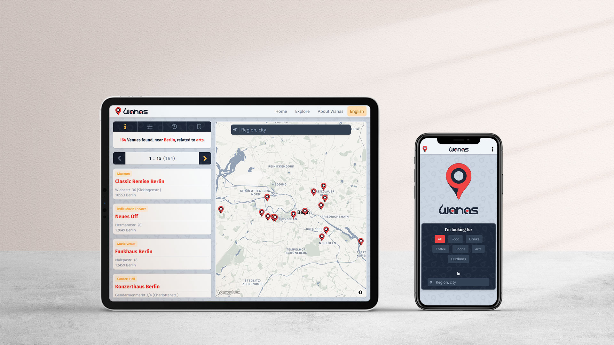

<h1 align='center'>Wanas</h1>

[](https://wanas.vercel.app/)

### Explore places near you and many other cities around the world.

Feeling in the mood to try a new place or planning to visit a city you don't know much about, Wanas app helps you explore places around you, and many other cities around the world.

You can filter places by "food, drinks, coffee, shops, arts, and outdoors", you can also control the search radius "5km, 10km, and 20km" or let the app suggest the radius according to the density of the places in the searched spot, and sort them by popularity or by the distance from you.

Visit the details page of any place and you can find its address, how others rated it, pricing hint, and tips that can be helpful; if you prefer using Google Maps, there will be a link to show the place location on Google Maps app.

---

## Features & tech-stack

- Built with NextJS, hosted on Vercel.
- Multi-language support by react-intl (en, es, ar).
- Global state management with Zustand & Immer.
- Styling with Tailwind.
- Fetching data with SWR & Axios.
- Map by Mapbox GL with custom style.
- Places data by FourSquare API.
- Custom scrollbar by Simplebar.
- Icons by FontAwesome.

---

## See Wanas in action

### Visit live demo

At [wanas.vercel.app](https://wanas.vercel.app/)

---

#### Or clone repository

`HTTPS`

```
https://github.com/amr-adel/wanas.git
```

`SSH`

```
git@github.com:amr-adel/wanas.git
```

`GitHub CLI`

```
gh repo clone amr-adel/wanas
```

Or download the repository as a [ZIP archive](https://github.com/amr-adel/wanas/archive/main.zip)

---

install all project dependencies with `npm install`

start the development server with `npm run dev`
